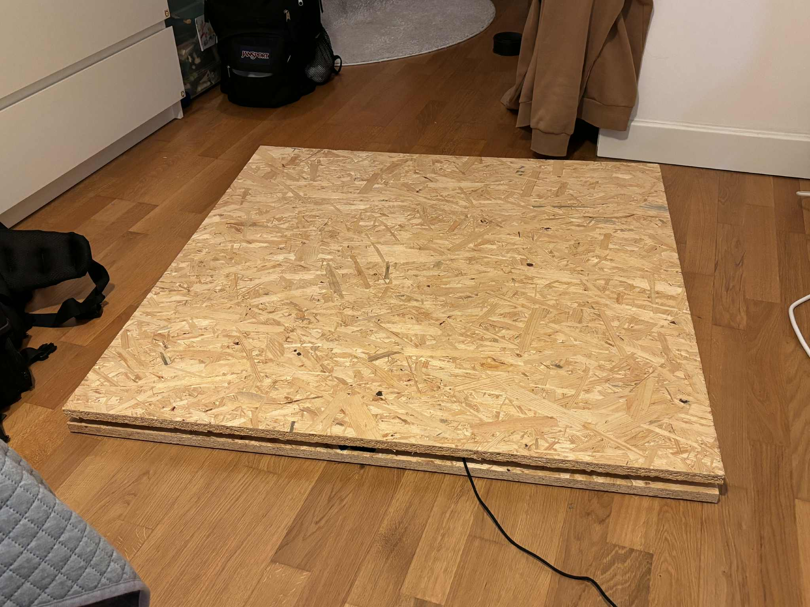
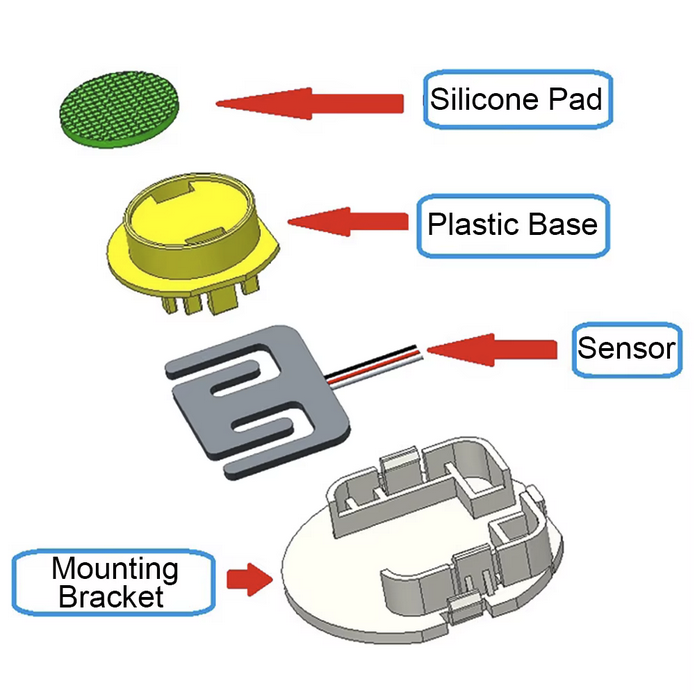
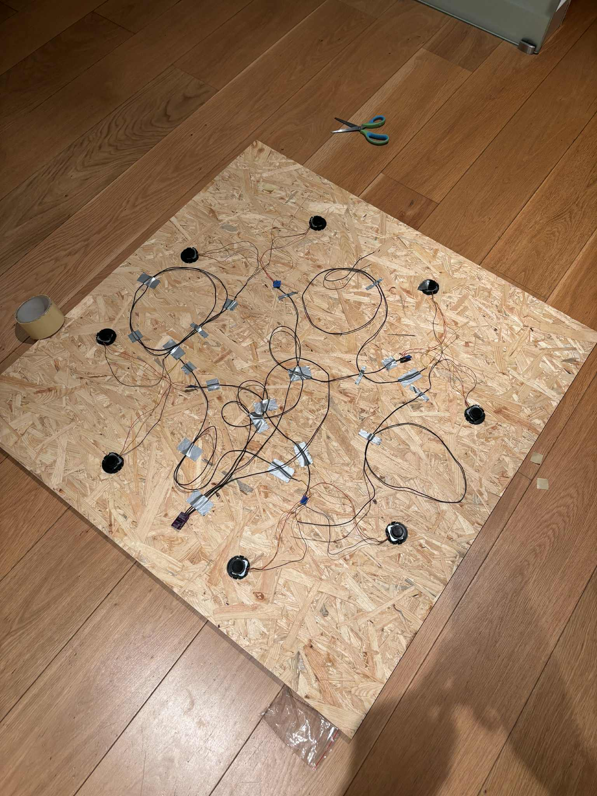
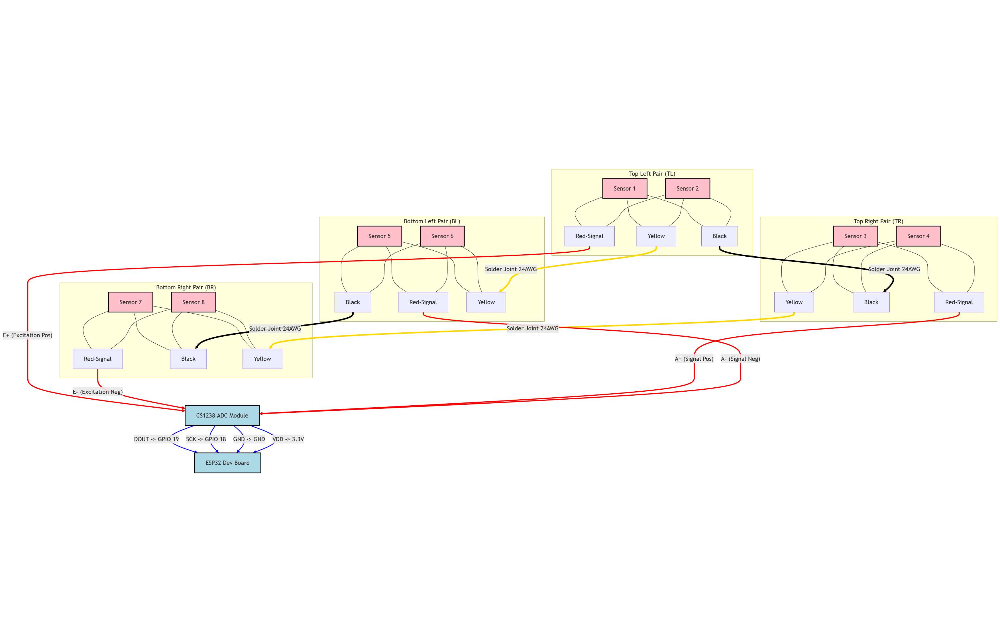
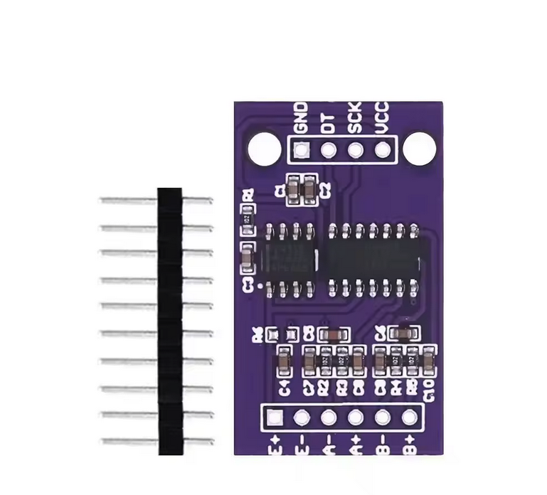
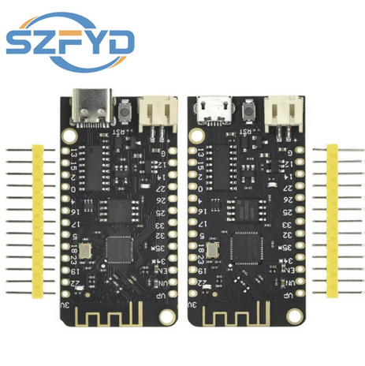
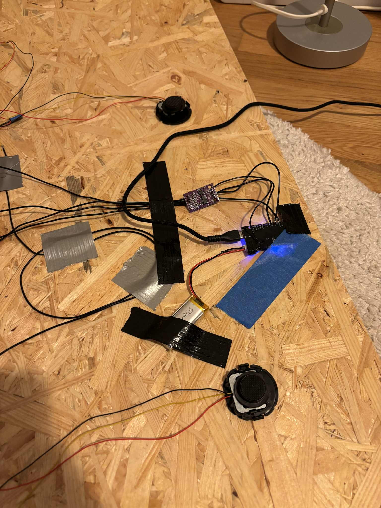
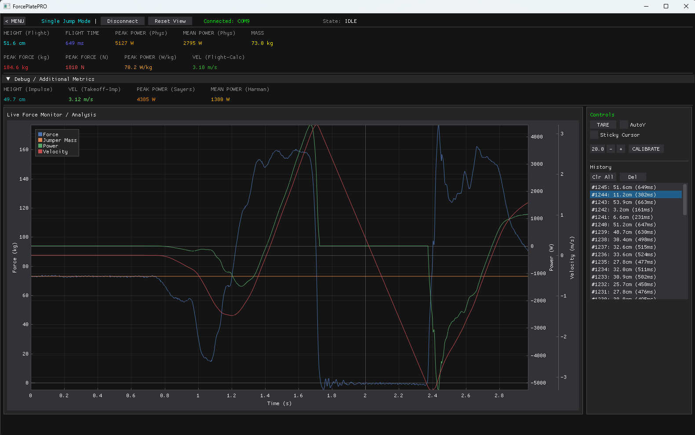

# Force Plate PRO
**Author:** Maciej Łukasiewicz  


*Figure 1. The assembled Force Plate PRO prototype (1m × 1m OSB).*

## 1. Introduction
Force Plate PRO is a cost-effective, high-precision measurement device designed for biomechanics, physiotherapy, and sports training. It measures ground reaction forces (GRF) to calculate jump height, flight time, power output, and takeoff velocity.

Unlike commercial solutions that cost thousands of dollars, this project utilizes affordable off-the-shelf components (ESP32, Load Cells) while maintaining high data quality through sophisticated software processing. The system features a split architecture: an ESP32 microcontroller acts as a high-speed digitizer (1280 Hz), while a custom Python desktop application handles complex physics integration and visualization.

## 2. Hardware Architecture

### 2.1 Load Cells
The platform uses **8 half-bridge strain gauge load cells** (50kg capacity each), arranged in an octagonal pattern. This configuration provides a total theoretical capacity of 400kg and ensures (somewhat)even sensitivity across the platform surface.

- **Sensor Type:** Strain Gauge (Half-Bridge)
- **Configuration:** 3-wire (Signal, Positive, Negative)
- **Principle:** $\Delta R/R = GF \cdot \epsilon$ (Resistance change proportional to strain)

<div style="display: flex; gap: 10px;">
  <div style="flex: 1; text-align: center;">
    
    <p><em>Fig 2. Strain Gauge Load Cell</em></p>
  </div>
  <div style="flex: 1; text-align: center;">
    
    <p><em>Fig 3. Octagonal Sensor Layout</em></p>
  </div>
</div>

### 2.2 Wheatstone Bridge & Wiring
The 8 sensors are wired into a **Full Wheatstone Bridge** configuration to maximize sensitivity and temperature compensation. The wiring creates a loop connecting all sensors to a central ADC.

**Wiring Instructions:**
The sensors are paired (Top-Left, Top-Right, Bottom-Left, Bottom-Right).
1.  **Pairing:** Connect the 3 wires of Sensor 1 and Sensor 2 together for each corner.
2.  **Bridge Loop (Black & Yellow wires):**
    - Connect **Black** wires of TL pair to **Black** wires of TR pair (Top horizontal).
    - Connect **Black** wires of BL pair to **Black** wires of BR pair (Bottom horizontal).
    - Connect **Yellow** wires of TL pair to **Yellow** wires of BL pair (Left vertical).
    - Connect **Yellow** wires of TR pair to **Yellow** wires of BR pair (Right vertical).
3.  **ADC Connection (Red wires):**
    - **TL Red** $\rightarrow$ **E+** (Excitation +)
    - **BR Red** $\rightarrow$ **E-** (Excitation -)
    - **TR Red** $\rightarrow$ **A+** (Signal +)
    - **BL Red** $\rightarrow$ **A-** (Signal -)


*Figure 4. Wiring Diagram: Wheatstone Bridge to CS1238 ADC and ESP32.*

### 2.3 Electronics
The core electronics consist of a precise ADC and a dual-core microcontroller.

*   **CS1238 ADC:** A 24-bit Analog-to-Digital Converter designed for weigh scales. Configured for **1280 SPS (Samples Per Second)** and PGA Gain of 128.
*   **ESP32:** Reads data via 2-wire interface (SCK/DOUT) and streams it over USB Serial at **921600 baud**.

| Parameter | Value |
|-----------|-------|
| ADC Resolution | 24-bit |
| Sampling Rate | 1280 Hz |
| Microcontroller | ESP32 (Lolin32 Lite) |
| Communication | USB Serial (JSON) |

**Data Format:**
The ESP32 sends a clean JSON stream containing only the raw weight value. Timestamping is handled by the PC to ensure consistency.
```json
{"w": 123456}
```

<div style="display: flex; gap: 10px;">
  <div style="flex: 1; text-align: center;">
    
    <p><em>Fig 5. CS1238 ADC Module</em></p>
  </div>
  <div style="flex: 1; text-align: center;">
    
    <p><em>Fig 6. ESP32 Microcontroller</em></p>
  </div>
</div>


*Figure 7. Assembled electronics with LiPo battery.*

---

## 3. Software Architecture

The software is divided into two parts:
1.  **Firmware (`platform_send.ino`)**: Minimal ESP32 code. Streams raw ADC data and handles bare-metal timing.
2.  **Desktop App (`python_app`)**: Heavy lifting, physics integration, UI, and data storage.

### 3.1 Python Application Structure
The desktop application is built using **Python 3.10** and **DearPyGui** (GPU-accelerated GUI). It follows a modular architecture:

*   **`main.py`**: Entry point. Initializes the `PhysicsEngine`, `SerialHandler`, and the UI loop.
*   **`physics.py`**: The core Physics Engine.
    *   **Circular Buffering:** Stores last ~8s of high-frequency data for "Retroactive Analysis" (e.g., looking back 100ms before a trigger).
    *   **Integration Loop:** Calculates Velocity and Power frame-by-frame.
    *   **Calibration:** Handles linear regression to convert raw ADC values to Kilograms.
*   **`modes/`**: State Machine implementations for different exercises.
    *   **`single_jump.py`**: Implements the Countermovement Jump (CMJ) logic.
        *   *States:* `IDLE` $\rightarrow$ `WEIGHING` $\rightarrow$ `READY` $\rightarrow$ `PROPULSION` $\rightarrow$ `IN_AIR` $\rightarrow$ `LANDING`.
        *   *Features:* Automatic bodyweight detection, unweighting phase handling, and bounce protection during landing.
*   **`ui/`**: User Interface modules managed by DearPyGui.
    *   **`plot_manager.py`**: Handles high-performance plotting, downsampling 1280Hz data to 60FPS for rendering.
*   **`database.py`**: SQLite storage for jump history and user settings.

### 3.2 Physics Algorithms
The system uses the **Impulse-Momentum Method** to calculate jump metrics from Force-Time data.

1.  **Net Force:** $F_{net} = F_{measured} - (mass \cdot g)$
2.  **Acceleration:** $a(t) = F_{net}(t) / mass$
3.  **Velocity:** $v(t) = \int a(t) dt$
4.  **Power:** $P(t) = F_{measured}(t) \cdot v(t)$

**Key Algorithmic Features:**
*   **Retroactive Trigger:** When movement is detected, the integration start time is moved back ~75ms to capture the initial unweighting phase accurately.
*   **Drift Compensation:** Sensor zero-point is automatically tracked during IDLE states.
*   **Noise Clamping:** Negative sensor noise during deep unweighting is clamped to prevent "Positive Power" artifacts (since Force < 0 is physically impossible on a platform).


*Figure 8. Desktop Application Interface showing Force, Velocity, and Power curves.*

## 4. Usage

### 4.1. Firmware Flashing (ESP32)
1.  Install **Arduino IDE**.
2.  Install the **ESP32 Board Manager** (by Espressif).
3.  Open `ESP32/platform_send/platform_send.ino`.
4.  Select your board (e.g., *WEMOS LOLIN32 Lite*) and Port.
5.  Click **Upload**.

### 4.2. Python Application
1.  Install Python 3.10 or newer.
2.  Install dependencies:
    ```bash
    pip install -r python_app/requirements.txt
    ```
3.  Run the application:
    ```bash
    python python_app/main.py
    ```

### Operation
1.  **Auto-Connect:** The app automatically connects to the ESP32 (defaulting to COM9, or first available).
2.  **Tare:** Ensure the platform is empty. The system auto-tares on startup. You can trigger a re-tare via the UI.
3.  **Measurement:**
    - Stand still ("WEIGHING").
    - Wait for "READY" state (Green).
    - Perform a jump.
4.  **Analysis:** View Height, Power, Velocity, and Phase timings (Unweighting, Braking, Propulsion) with full graph visualization.

## 5. Future Development
- **Bluetooth (BLE):** The firmware supports keeping the ESP32 entirely wireless.
- **Metal Enclosure:** migrating from OSB to a metal frame for better rigidity.
- **Cloud Sync:** Uploading jump data to a web dashboard.
